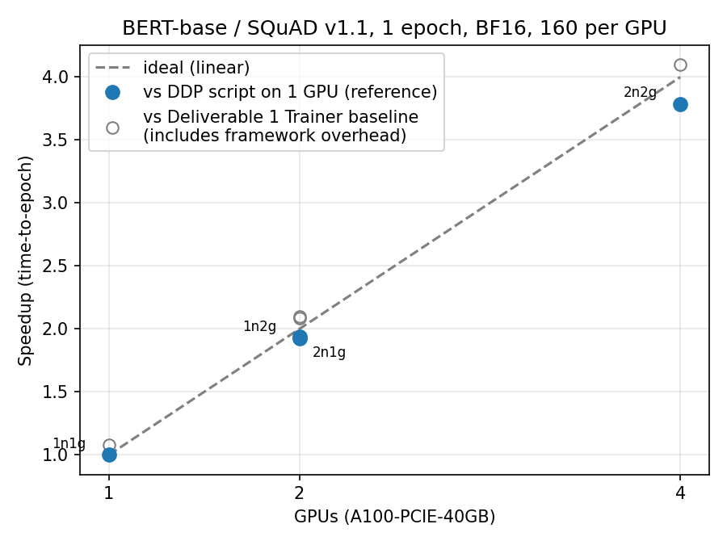
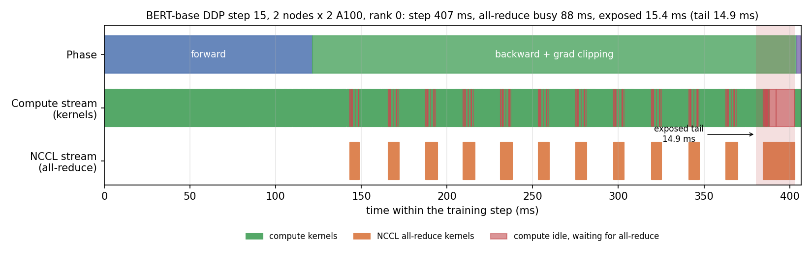

# HPC Tools for AI — BERT/SQuAD Distributed Training (2 nodes × 2 A100)

**Platform:** CESGA FinisTerrae III
**Model:** `google-bert/bert-base-uncased`
**Dataset:** SQuAD v1.1
**Strategy:** PyTorch DistributedDataParallel (NCCL), launched with `srun`, one process per GPU
**Hardware:** 2 nodes × 2 NVIDIA A100-PCIE-40GB, InfiniBand HDR100
**Baseline:** [`../BASELINE`](../BASELINE): 1 × A100, 234.58 s per epoch (tag `BASELINE`)

---

## Abstract

This deliverable distributes the single-GPU BERT/SQuAD fine-tuning of Deliverable 1 over **2 FinisTerrae III nodes with 2 A100 GPUs each**, using native PyTorch **DistributedDataParallel (DDP)** with the NCCL backend. Model, preprocessing, BF16 precision, per-GPU batch size (160), optimizer settings, seed and the timed region are the same as in the baseline; only the number of GPUs changes.

On 4 GPUs one SQuAD epoch takes **57.24 s ± 0.63 s** (3 runs, CV 1.10%). Against the same training script on one GPU (216.73 s) this is a **3.79× speedup, 94.7% parallel efficiency**; against the official Hugging Face Trainer baseline (234.58 s) it is 4.10×. The remaining 5% is mostly (about two thirds) the exposed all-reduce tail, a **≈15 ms wait per step** while the last gradient buckets, including the word-embedding gradient, cross the InfiniBand link; the rest is fixed per-step costs.

> **Result:** 2 × 2 A100 · BF16 · 160 per GPU (global 640) · 1 epoch · **57.24 s** · **3.79×** vs DDP on 1 GPU · **94.7%** efficiency

---

## 1. Objectives

- Reduce the time to train one SQuAD epoch with data parallelism over 2 nodes × 2 GPUs.
- Keep every hyper-parameter of the baseline except the number of GPUs.
- Separate intra-node from inter-node communication cost and explain the gap to linear scaling with measurements (all-reduce bandwidth, InfiniBand traffic, profiler trace).

---

## 2. Strategy choice

BERT-base with the QA head has 108,893,186 parameters and its peak allocation at batch 160 is 26.0 GiB of the 40 GB of an A100. The model fits comfortably on one GPU, so there is nothing to shard: **pure data parallelism** is the right strategy, and among the data-parallel options native DDP is the simplest and most transparent.

| Option | How it scales BERT-base | Verdict |
|---|---|---|
| **PyTorch DDP** (`torch.distributed` + `DistributedDataParallel`) | Model replicated per GPU; gradients all-reduced in buckets, overlapped with backward | **Chosen** |
| `torch.nn.DataParallel` | Single process, multiple threads; one node only | Rejected: GIL contention, no multi-node |
| Hugging Face Trainer / Accelerate in DDP mode | Same algorithm as DDP, wrapped by the framework | Possible, but hides initialisation, sampling and timing behind defaults |
| PyTorch Lightning / Fabric | DDP underneath | Requires a rewrite for no performance gain |
| DeepSpeed ZeRO-1/2, FSDP / ZeRO-3 | Shard optimizer states, gradients or parameters | Unnecessary: no memory pressure, and sharding adds communication |
| Horovod | Ring all-reduce over MPI | Extra MPI/NCCL build for the same algorithm |

Design decisions:

- **NCCL backend**: the standard choice for NVIDIA GPUs over InfiniBand.
- **One process per GPU, launched by `srun`**: SLURM places the ranks; `SLURM_PROCID` / `SLURM_LOCALID` / `SLURM_NTASKS` become `RANK` / `LOCAL_RANK` / `WORLD_SIZE`; `MASTER_ADDR` is the first node of the allocation.
- **Explicit training loop** (`train_ddp.py`) instead of the Trainer, so that every step of the distributed algorithm (initialisation, sampler, DDP wrapping, timing, rank-0 I/O) is visible and measured.

---

## 3. Hardware and software setup

| Item | Value |
|---|---|
| Nodes | FinisTerrae III `a100` nodes, 2 × A100-PCIE-40GB each; SLURM policy 32 CPU cores per A100 |
| GPUs | 4 × NVIDIA A100-PCIE-40GB (2 per node) |
| GPU ↔ GPU inside a node | `SYS` in `nvidia-smi topo -m`: the two GPUs are attached to different CPU sockets (NUMA nodes 0 and 2). No PCIe peer-to-peer path, so NCCL uses **shared memory through the host** (`SHM/direct`) |
| Interconnect | `mlx5_2`, ConnectX-6, **InfiniBand HDR100: 100 Gb/s (2X HDR) = 12.5 GB/s per direction**, one link per node, used by NCCL (`NET/IB/0`) |
| GPU ↔ InfiniBand NIC | `SYS` for both GPUs: the IB adapter sits on a different socket from each GPU |
| GPUDirect RDMA | **Not used** (NCCL: `use ring PXN 0 GDR 0`): inter-node traffic is staged through host memory |
| Second adapter | `mlx5_bond_0`, 25 Gb/s Ethernet (RoCE), not used by NCCL for data |
| Software | Python 3.10.8, PyTorch 2.11.0+cu128 (CUDA 12.8), NCCL 2.28.9, Transformers 5.17.0, Datasets 5.0.1 |
| SLURM layout (2n2g) | `--nodes=2 --ntasks-per-node=2 --cpus-per-task=32 --gres=gpu:a100:2 --mem=64G` |

The link rate comes from `ibstat` / `/sys/class/infiniband/mlx5_2/ports/1/rate` on an A100 node; the topology from the `topo_<host>.txt` files saved by every run (same GPU and InfiniBand placement on every node used).

---

## 4. Implementation

### 4.1 Differences from the baseline

| Concern | Baseline (`BASELINE/train.py`) | This deliverable (`train_ddp.py`) |
|---|---|---|
| Process model | 1 process, exactly 1 visible GPU | 1 process per GPU, ranks from SLURM (or torchrun) variables |
| Communication | none | `dist.init_process_group("nccl")`, each process bound to its GPU |
| Model | plain module | `DistributedDataParallel(model, device_ids=[gpu], find_unused_parameters=False)`, 25 MB buckets |
| Data | Trainer random sampler over 88,492 features | `DistributedSampler`: each rank gets a disjoint 1/p shard, `set_epoch()` every epoch |
| Tokenisation | in every run | once, saved with `save_to_disk`; every rank uses `load_from_disk` |
| Optimizer / schedule | Trainer defaults | the same written out: fused AdamW (no decay on bias/LayerNorm), linear decay, grad-norm clip 1.0 |
| Mixed precision | `bf16=True` | `torch.autocast("cuda", dtype=torch.bfloat16)` |
| Timing | sync → `trainer.train()` → sync | barrier + sync → loop → sync + barrier; slowest rank |
| Output | JSON | rank 0 only; other ranks wait at a barrier |

### 4.2 Key code

```python
# torch.distributed initialisation (works under srun and torchrun)
rank = int(os.environ.get("RANK", os.environ.get("SLURM_PROCID", 0)))
local_rank = int(os.environ.get("LOCAL_RANK", os.environ.get("SLURM_LOCALID", 0)))
world_size = int(os.environ.get("WORLD_SIZE", os.environ.get("SLURM_NTASKS", 1)))
torch.cuda.set_device(local_rank if torch.cuda.device_count() > 1 else 0)
dist.init_process_group(backend="nccl", init_method="env://", rank=rank,
                        world_size=world_size, device_id=device)

# DDP wrapping and data sharding
ddp_model = DDP(model, device_ids=[device.index], bucket_cap_mb=25,
                find_unused_parameters=False)
sampler = DistributedSampler(train_dataset, num_replicas=world_size, rank=rank,
                             shuffle=True, seed=42)

# Timed region: all ranks start together, the slowest rank defines the time
barrier(device); torch.cuda.synchronize(device); t0 = time.perf_counter()
...  # training loop
torch.cuda.synchronize(device); barrier(device); wall_seconds = time.perf_counter() - t0
```

### 4.3 Launch chain

`ddp.slurm` (resources, `MASTER_ADDR`/`MASTER_PORT`, offline Hugging Face cache) → `srun` (one task per GPU) → `run_ddp_task.sh` (rank variables, 1 Hz `nvidia-smi` sampler and `topo -m` on the first task of each node) → `train_ddp.py`.

---

## 5. Methodology

- **Training time T(p):** wall-clock time of the training loop on *p* GPUs, from a barrier before the first batch to a barrier after the last optimizer step (after `torch.cuda.synchronize()`), i.e. the time of the slowest rank. Model loading, tokenisation and process-group setup are excluded, as in the baseline.
- **Speedup S(p) = T_ref / T(p)** against two references:
  - **the DDP script on 1 GPU (`1n1g`, 216.73 s): the main reference**, same code, so the speedup measures only the distribution;
  - the official Trainer baseline (234.58 s), for continuity with Deliverable 1.
- **Parallel efficiency E(p) = S(p) / p**; **throughput** = 88,492 features / T(p).
- **Configurations** (*N*n*G*g = *N* nodes × *G* GPUs per node):
  - `1n1g`: 1 GPU, the reference;
  - `1n2g`: intra-node scaling only (shared memory, no network);
  - `2n1g`: inter-node scaling only (InfiniBand);
  - `2n2g`: the target, 2 nodes × 2 GPUs.
- **Repetitions:** 3 full-epoch runs per configuration. Every run records its node list, per-rank times, peak memory, GPU samples and InfiniBand port counters (`results/runs/<config>/bench_r*_job<id>/`).
- **Isolation:** `1n2g` and `2n2g` allocate both GPUs of each node. `1n1g` and `2n1g` use one GPU per node and were run with `--exclusive` so that no other job shares the node, its PCIe host bridge or its InfiniBand link (see §9).

---

## 6. Results

| Config | GPUs | Global batch | Mean time (s) | Std (s) | CV | Samples/s | Speedup vs DDP-1GPU | Efficiency | Speedup vs Trainer baseline | GPU util | IB TX/node (GB) | Mean loss |
|---|---:|---:|---:|---:|---:|---:|---:|---:|---:|---:|---:|---:|
| 1n1g | 1 | 160 | 216.73 | 1.17 | 0.54% | 408 | 1.00× | 100.0% | 1.08× | 99.7% | 0.0 | 1.7158 |
| 1n2g | 2 | 320 | 112.37 | 1.57 | 1.40% | 788 | 1.93× | 96.4% | 2.09× | 99.3% | 0.0 | 2.0394 |
| 2n1g | 2 | 320 | 111.79 | 0.42 | 0.37% | 792 | 1.94× | 96.9% | 2.10× | 99.4% | 121.4 | 2.0405 |
| **2n2g** | **4** | **640** | **57.24** | **0.63** | **1.10%** | **1546** | **3.79×** | **94.7%** | **4.10×** | 98.1% | 91.6 | 2.5548 |

All 12 runs completed the full epoch (554 / 277 / 277 / 139 optimizer steps per rank). Full table with per-configuration min/max, rank imbalance and peak memory: [`results/summary.csv`](results/summary.csv); generated by `summarize_results.py --tag bench`.



---

## 7. Profiling

### 7.1 GPU utilisation

Mean utilisation over active samples stays at **98–99.7%** in every configuration, against 89.6% for the Trainer baseline in the Deliverable 1 profiling run ([`BASELINE/README.md`](../BASELINE/README.md), §7). Adding GPUs does not starve them: the ranks spend almost all their time computing.

### 7.2 NCCL transport

From the `NCCL_DEBUG=INFO` smoke tests: all ranks report `Using network IB` on `mlx5_2:1/IB`; the edges between nodes are `via NET/IB/0` and the edges inside a node `via SHM/direct/direct`; `GDR 0` (no GPUDirect RDMA). The profiler trace shows that the training all-reduce kernels are `ncclDevKernel_AllReduce_Sum_f32_RING_LL` (ring algorithm).

### 7.3 All-reduce bandwidth (`allreduce_bench.py`)

One full FP32 gradient (435.6 MB), averaged over 20 iterations, slowest rank:

| Config | Path | Time (ms) | algbw (GB/s) | busbw (GB/s) |
|---|---|---:|---:|---:|
| 1n2g | SHM through host memory | 34.0 | 12.81 | 12.81 |
| 2n1g | InfiniBand | 40.3 | 10.80 | 10.80 |
| 2n2g | SHM + InfiniBand | 42.9 | 10.16 | 15.24 |

The InfiniBand case reaches 10.80 GB/s, **86% of the 12.5 GB/s HDR100 line rate**, without GPUDirect RDMA. Without DDP's overlap, a full all-reduce would cost 40–43 ms per step across nodes, about 10% of a 391 ms step.

### 7.4 InfiniBand traffic during training

Measured from the port counters around the timed loop, per node and per epoch:

| Config | Measured | Prediction | Prediction formula |
|---|---:|---:|---|
| 2n1g | **121.4 GB** | 120.7 GB | 277 steps × 435.6 MB (two-rank ring: each rank sends one full gradient) |
| 2n2g | **91.6 GB** | 90.8 GB | 139 steps × 1.5 × 435.6 MB (four-rank ring: 2(p−1)/p of the gradient per rank; one ring edge per node crosses the network) |

The measured volume is within 1% of the ring all-reduce prediction, so there is no unexpected traffic.

### 7.5 Timeline of one 2n2g step (PyTorch profiler, rank 0)



Step 15 of the profiler run (job 10312820), drawn by `plot_profile.py` from the rank-0 trace:

| Phase / event | Time |
|---|---:|
| Whole step | 406.6 ms |
| Forward | 121.3 ms |
| Backward + gradient clipping | 282.7 ms |
| Optimizer (fused AdamW) | 2.5 ms |
| All-reduce kernels (13 buckets) | 88.2 ms busy on their own stream |
| Compute stream idle waiting for all-reduce | 15.4 ms (82% of the all-reduce is hidden) |
| …of which the tail before the optimizer | **14.9 ms** |

The first bucket is reduced about 22 ms into the backward pass, and the next ones about every 22 ms, while backward kernels keep running on the compute stream. Only the last buckets cannot be hidden: their gradients are produced at the very end of backward, so clipping and the optimizer must wait for them. The profiled steps 13–17 all show a tail between 14.0 and 15.8 ms.

---

## 8. Analysis

### 8.1 Why 3.79× and not 4×

The exposed cost on 4 GPUs is T(4) − T(1)/4 = 57.24 − 54.18 = **3.06 s, or 22.0 ms per step** (139 steps).

- **Exposed all-reduce tail: ≈ 14.9 ms per step → ≈ 2.07 s per epoch (two thirds of the loss).**
  - DDP reduces gradients in buckets in reverse order of the parameters. The word embeddings are the first parameters of the model, so their gradient falls in the last bucket to become ready: 30,522 × 768 × 4 bytes = 93.8 MB, about 22% of the whole gradient.
  - The embedding gradient is computed by the very last operation of the backward pass, so there is no compute left to hide its transfer behind.
  - The two last all-reduce kernels in the trace take 7.5 ms and 10.7 ms, the largest of the step.
- **Fixed costs: the remaining ≈ 1.0 s (≈ 7 ms per step).** These are not individually measured; they include:
  - the first-iteration warm-up (CUDA/cuBLAS heuristics, NCCL channel setup, DDP bucket rebuild);
  - the short waits when each bucket starts (≈ 0.5 ms per step in the profile);
  - the final barrier;
  - the last partial batch: 22,123 features per rank = 138 full batches + 1 of 43.

  None of these shrink with *p*, so they weigh 4× more over 139 steps than over 554 (Amdahl).
- **Load balance is not a factor:** all ranks finish within about 1 ms of each other, GPU utilisation stays at 98%, and no stragglers appear.

### 8.2 Intra-node vs inter-node

| Config | Path | Time (s) | Efficiency | Exposed per step |
|---|---|---:|---:|---:|
| 1n2g | SHM, both GPUs on different sockets | 112.37 | 96.4% | 14.4 ms |
| 2n1g | InfiniBand HDR100, one rank per node | 111.79 | 96.9% | 12.3 ms |

- **Distance costs almost nothing.** Inside a node, the GPU-to-GPU path crosses the inter-socket link through host memory (12.81 GB/s), so it is not much faster than the network (10.80 GB/s). Both paths are hidden behind the backward pass to the same degree, and spreading the work over two nodes costs no more than staying inside one.
- **2n2g combines both paths.** Each node sends 1.5× the gradient per step over its single link, which explains its larger tail. Its efficiency (94.7%) stays within 2 points of the two-GPU configurations.

### 8.3 The DDP script is faster than the Trainer baseline on one GPU

With an identical workload (88,492 features, 554 steps, BF16, batch 160, same optimizer settings) the DDP script on one GPU takes **216.73 s, against 234.58 s for the Trainer: the Trainer is ≈ 8% slower**. GPU utilisation shows where the difference comes from: **89.6%** for the Trainer (Deliverable 1 profiling run, [`BASELINE/README.md`](../BASELINE/README.md) §7) against **99.7%** for the explicit loop (mean of the three `1n1g` runs).

- **Likely cause:** per-step host-side work in the Trainer (callbacks, logging bookkeeping, a loss NaN/Inf check that forces a GPU synchronisation every step) leaves the GPU idle between steps. The explicit loop only synchronises every 50 steps.
- **Consequence:** speedups against the Trainer (up to 4.10×, efficiencies above 100%) mix the effect of distribution with this framework overhead. That is why all efficiencies in this report use the DDP script on one GPU as the reference.

### 8.4 Global batch and training loss

With 160 samples per GPU the global batch grows with the number of GPUs, which changes the optimisation:

| GPUs | Global batch | Updates per epoch | Mean training loss |
|---:|---:|---:|---:|
| 1 | 160 | 554 | 1.716 |
| 2 | 320 | 277 | 2.04 |
| 4 | 640 | 139 | 2.555 |

- **Same learning rate, fewer updates:** every configuration processes the same 88,492 features with the same work per GPU, so the performance comparison is fair. But 4 GPUs make 4× fewer updates at the same learning rate, which leaves a higher training loss after one epoch.
- **Not a bug:** it is the usual large-batch trade-off. Scaling the learning rate with warm-up, or training more epochs, would recover the loss; this deliverable keeps the baseline hyper-parameters unchanged on purpose.
- **Consistency check:** `1n2g` and `2n1g` reach the same loss (2.039 / 2.041). The computation does not depend on where the ranks are placed.

---

## 9. Challenges and solutions

| Problem | Cause | Fix |
|---|---|---|
| First `1n1g` and `2n1g` runs shared nodes with other jobs of the campaign: two `2n1g` runs used the same node pair (and InfiniBand link) at the same time, and `1n1g` runs shared nodes with a `2n1g` rank | A one-GPU request (`--gres=gpu:a100:1`) only takes half a node, so SLURM packs other jobs on the free GPU. The InfiniBand counters then also counted the neighbour's traffic (`2n1g` showed 241–243 GB per node instead of 121 GB; `1n1g` showed 121 GB instead of 0) | Reran `1n1g` and `2n1g` with `--exclusive`. The co-located runs are kept as evidence in `results/runs/*/coloc_bench_*` and excluded from the summary. The clean runs changed `2n1g` from 112.77 s to 111.79 s and lowered its CV from 0.88% to 0.37% |
| Jobs on compute nodes cannot download the model or dataset | FinisTerrae III compute nodes have no internet access | The model and SQuAD come from the local Hugging Face cache populated in Deliverable 1; `ddp.slurm` and `allreduce.slurm` export `HF_HUB_OFFLINE=1 HF_DATASETS_OFFLINE=1`, and tokenisation runs once with the same variables |
| The virtual environment of Deliverable 1 no longer existed | The original working copy, including `.venv`, had been removed | Rebuilt `.venv` from the pinned `requirements.txt` (same versions as the baseline plus `matplotlib`) with Python 3.10.8 |

---

## 10. Reproducibility

From the repository root on a FinisTerrae III login node:

```bash
module load python/3.10.8
python3 -m venv .venv && source .venv/bin/activate
python -m pip install -r DISTRIBUTED/requirements.txt
cd DISTRIBUTED

# 1. Tokenise SQuAD once on a compute node (offline, from the local Hugging Face cache)
srun -N 1 -n 1 -c 8 --mem=16G --time=00:15:00 bash -c '
  module load python/3.10.8 && source ../.venv/bin/activate &&
  export HF_HUB_OFFLINE=1 HF_DATASETS_OFFLINE=1 &&
  python train_ddp.py --prepare-data-only \
         --tokenized-dir "$PWD/data/squad_bert-base-uncased_len384_stride128"'

# 2. One 2 x 2 run
sbatch ddp.slurm

# 3. Scaling campaign: 3 runs of 1n1g, 1n2g, 2n1g, 2n2g (12 jobs);
#    1n1g and 2n1g are submitted with --exclusive (see section 9)
./submit_benchmarks.sh

# 4. All-reduce bandwidth
sbatch allreduce.slurm                                                       # 2n2g
sbatch --nodes=1 allreduce.slurm                                             # 1n2g
sbatch --nodes=2 --ntasks-per-node=1 --gres=gpu:a100:1 allreduce.slurm       # 2n1g

# 5. Profiler run and timeline figure
RUN_TAG=profile EXTRA_ARGS="--max-steps 30 --torch-profile" sbatch ddp.slurm
python plot_profile.py results/runs/2n2g/profile_job<id>/torch_profile/rank0_step18.json \
       --step 15 --output results/profile_2n2g.png

# 6. Summary table and scaling plot
python summarize_results.py --tag bench
```

Environment: `requirements.txt` (same versions as `BASELINE` plus `matplotlib`). Seed 42. Commit: tag `DISTRIBUTED`.

---

## 11. Repository structure

```text
DISTRIBUTED/
├── README.md               this report
├── requirements.txt        pinned environment (baseline + matplotlib)
├── train_ddp.py            DDP training script (explicit loop, rank-0 I/O, per-rank metrics)
├── ddp.slurm               SLURM job: resources, rendezvous, srun launch (default 2 nodes x 2 GPUs)
├── run_ddp_task.sh         per-task wrapper: rank variables, GPU sampler, topology dump
├── submit_benchmarks.sh    submits the 1n1g/1n2g/2n1g/2n2g campaign (--exclusive for 1 GPU per node)
├── allreduce_bench.py      NCCL all-reduce micro-benchmark
├── allreduce.slurm         SLURM job for the all-reduce benchmark
├── summarize_results.py    builds results/summary.{csv,md} and results/scaling.png
├── plot_profile.py         draws results/profile_2n2g.png from a profiler trace
├── data/                   tokenised SQuAD (generated, not in git)
└── results/
    ├── summary.csv, summary.md, scaling.png, profile_2n2g.png
    ├── runs/<config>/bench_r*_job<id>/          valid benchmark runs (JSON, GPU samples, topology)
    ├── runs/<config>/coloc_bench_r*_job<id>/    first 1n1g/2n1g runs that shared nodes (evidence only)
    ├── runs/<config>/{smoke,first,profile}_job<id>/  smoke tests, first full epochs, profiler run
    └── allreduce/<config>/job<id>/allreduce.json
```

---

## 12. Conclusion

Native PyTorch DDP over 2 nodes × 2 A100 trains one SQuAD epoch of BERT-base in **57.24 s, 3.79× faster than the same code on one GPU (94.7% efficiency)** and 4.10× faster than the Deliverable 1 Trainer baseline. Communication is almost entirely hidden behind the backward pass: the ring all-reduce moves 91.6 GB per node, within 1% of the prediction, over HDR100 InfiniBand at up to 86% of the line rate, and only a ≈15 ms tail per step, dominated by the word-embedding gradient, remains exposed. Intra-node and inter-node scaling cost the same on these nodes, because both GPUs and the network adapter sit on different CPU sockets and NCCL goes through host memory in both cases. Scaling further would make that tail and the fixed per-step costs weigh more; larger per-GPU batches, BF16 gradient compression, or GPUDirect RDMA would be the next levers to try.
